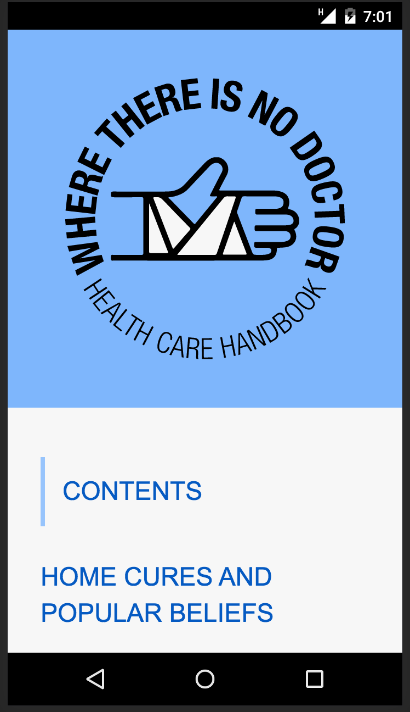

WHERE THERE IS NO DOCTOR
---
A Village Health Care Book

_Open Sourced in 1977 by [David Werner](http://davidbwerner.info/), Carol Thuman, Jane Maxwell
(orignal title: Donde No Hay Doctor ISBN	978-0-942364-15-6)_

# Status:
- Plan to make a mobile friendly version.
- Plan to make it working off-line too via serviceworkers.
- As second step make it easily translatable.

# 2do
- [ ] setup [upup.js]() 

# Done:
- [X] inital collection of PDF release
- [X] logo thanks to david@[work-it](http://work-it.it)
- [X] github repo
- [X] https [check](https://junglesta.github.io/wherenodoctor/)

# Source:

## Where There Is No Doctor
The most widely-used health care manual for health workers, educators, and others involved in primary health care and health promotion around the world. Current edition includes updated information on malaria, HIV, and more.

In the Journal of the American Medical Association, a 2010 review said,

>it is still not known if the book effectively improves health. [However,] In most of the world, where physicians are not available and diseases are rampant, the status quo is unacceptable. Until better solutions are created, Where There is No Doctor is probably a useful stop-gap measure. [8](https://dx.doi.org/10.1001%2Fjama.2010.244)

[read more on wikipedia](https://en.wikipedia.org/wiki/Where_There_Is_No_Doctor)

Firstly published in 1977 by [hesperian.org](http://hesperian.org/books-and-resources/)

![cover] (https://upload.wikimedia.org/wikipedia/en/f/f9/Where_There_Is_No_Doctor_book_cover%2C_13th_revised_printing.jpg)
